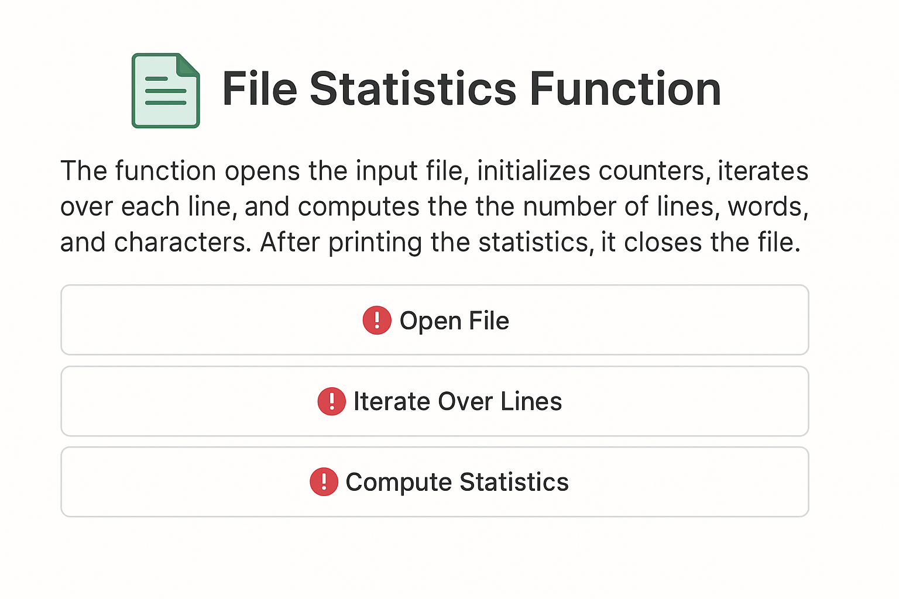

## 📄 Advanced File Statistics Analyzer

### 📊 Visual Overview

The function initiates by invoking the `open()` built-in method to instantiate a file object from the path provided via the `in_file` parameter, subsequently binding this object to the `open_file` identifier for stream manipulation. It proceeds to declare and zero-initialize several accumulator variables — `lines`, `words`, `characters`, and more — which serve as statistical counters for:

- Line count
- Lexical token count
- Character cardinality
- Blank line count
- Longest and shortest line lengths
- Average word and line length
- Alphabetic vs numeric word classification
- Line content complexity (special character presence)
- Top 10 most frequent words

---

### 🔁 Iteration Logic

The primary processing phase leverages an implicit iterator over the `open_file` object, enabling sequential access to each textual line in a memory-efficient manner. For each `current_line`, the function executes the following operations:

- **Line Counting & Classification:**  
  `lines` is incremented to reflect the cumulative tally of newline-delimited segments, and `blank_lines` is updated when a line contains no content.

- **Line Length Evaluation:**  
  Measures and stores each line's length to update minimum, maximum, and average values across all lines.

- **Special Character Detection:**  
  Analyzes each line to determine if it contains non-alphanumeric, non-whitespace characters.

- **Word Tokenization & Classification:**  
  Each line is tokenized via `.split()`, and `words` is incremented by the count of resulting substrings. Each token is then classified as alphabetic or numeric for refined statistics.

- **Character Accumulation:**  
  `characters` is incremented by the length of `current_line`, accounting for all glyphs, including whitespace and newline escapes (`\n`).

- **Lexical Profiling:**  
  The `Counter` object tracks the frequency of each word, enabling post-analysis reporting of the top 10 most common tokens.

---

### 📊 Output & Cleanup

Upon completion of the input stream traversal, the function outputs a formatted summary of the derived metrics:

- Total lines and blank lines processed
- Total words, alphabetic words, and numeric words parsed
- Cumulative character count
- Longest and shortest line lengths
- Average word length and average line length
- Number of lines with special characters
- Top 10 most common words in the file

Finally, the file stream is closed using `.close()` to ensure proper resource deallocation and prevent file descriptor leakage.

---

### ✅ Summary

This function performs a comprehensive textual analysis of the input file, generating granular insights into its structure, lexical diversity, and complexity. Ideal for debugging, auditing, content profiling, and pre-processing tasks in data pipelines or NLP workflows.

